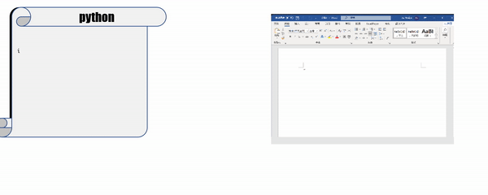

Xdocx
==========

Python library forked from [bayoo-docx](https://github.com/BayooG/bayoo-docx).
(original repository [python-docx](https://github.com/python-openxml/python-docx))



Description
-----------
add some features to the original library.(**To Be Continued ...**)

High Level API
 - add comment in any position of the paragraph
 - add insert in any position of the paragraph

Low Level API
 - Insert class & openxml element
 - Delete class & openxml element

Installation
------------

```bash
git clone https://github.com/xwy-bit/Xdocx.git
cd Xdocx
pip install .
```

Usage
-----

**Insert Demo**

[Method] 

paragraph.add_insert_by_range 

```
INPUT:
    @ text : the text you want to insert
    @ ins_index : the index of the insert position. The index is the text position in the paragraph. The index is start from 0.

OUTPUT:
    @ None
```

[Demo]

```python
from docx.text.paragraph import Paragraph
import docx

doc = docx.Document('path/to/original.docx')
for idx , para in enumerate(doc.paragraphs):
    # you can use other method to select the paragraph , in this demo , we just use the index
    if idx == 6:
        print('=' * 40,'paragraph',idx,'=' * 40)
        '''
        example:
        ABCD  EFG 
            ⬆️ (TEST TEXT)
        '''
        para.add_insert_by_range(text = 'TEST TEXT' , ins_index = 4)
        print(para._element.xml)

doc.save('path/to/Insert_Demo.docx')
```

**Comment Demo**

[Method]
paragraph.add_cross_paragraph_comment_start_by_textidx()
```python
INPUT: 
    @ author
    @ Initial
    @ DATE / TIME
    @ Comment TEXT
    @ Charactor Index
```

